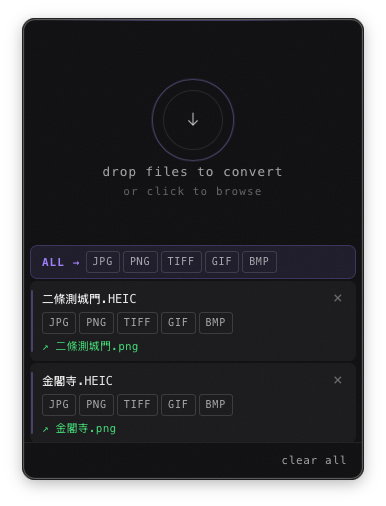

# Swift Shifter

A featherweight, always-on file converter that lives in your menu bar. Drop any file onto the floating window, or select files and hit a hotkey, and get instant format conversion without opening a browser or bulky software.

<center>

</center>

## Features

- **Floating drop zone** -- a small, always-on-top window accepts drag-and-drop from Finder or any file manager
- **Global hotkey** -- cmd + shift + Space toggles the window; conversion options appear immediately
- **Zero-friction UX** -- one click to pick the output format, conversion starts instantly
- **Broad format support**
  - Images: WebP, PNG, JPEG, AVIF, GIF, BMP, TIFF, HEIC/HEIF
  - Video: MP4, MOV, MKV, WebM, AVI, GIF (video-to-GIF and GIF-to-video)
  - Audio: MP3, AAC, FLAC, OGG, WAV, OPUS
  - Data: JSON, YAML, TOML, CSV
  - Documents: Markdown, plain text, HTML, LaTeX, Typst, PDF, EPUB, MOBI (via pandoc + pymupdf4llm/marker-pdf/Calibre)
- **Local LLM post-processing** -- optional Ollama integration cleans up extracted PDF text (configurable model and endpoint)
- **Output next to source** -- converted file lands in the same folder as the input (configurable)
- **Batch conversion** -- drop multiple files at once; common formats shown in a shared toolbar
- **Progress indicator** -- lightweight inline progress bar per file, no modal dialogs
- **Click to reveal** -- success label opens the output folder in Finder
- **Auto-update** -- checks for new releases on startup; installs in the background
- **Settings panel** -- configure output folder, JPEG/AVIF quality, concurrency, PDF conversion engine, and local LLM


## Tech Stack

| Layer               | Technology                                                                   |
| ------------------- | ---------------------------------------------------------------------------- |
| App shell           | [Tauri v2](https://tauri.app)                                                |
| Backend logic       | Rust                                                                         |
| Image processing    | [`image`](https://crates.io/crates/image) crate + [`ravif`](https://crates.io/crates/ravif) for AVIF + macOS `sips` for HEIC |
| Video / audio       | System `ffmpeg` (auto-installed via Homebrew if missing)                     |
| Document conversion | System `pandoc` (auto-installed via Homebrew / winget / apt if missing)      |
| PDF ↔ EPUB / HTML / MD | `pymupdf4llm` (auto-installed via pipx); optional ML engine via `marker-pdf`     |
| MOBI conversion     | System `ebook-convert` / Calibre (auto-installed via Homebrew cask / winget / apt) |
| Local LLM           | [Ollama](https://ollama.com) (optional); cleans up PDF extraction output            |
| Data serialization  | `serde_json`, `serde_yaml`, `toml`, `csv` crates                             |
| Frontend UI         | TypeScript + [Vite](https://vitejs.dev) (plain DOM, no framework)            |
| Global hotkeys      | `tauri-plugin-global-shortcut`                                               |
| System tray         | Tauri built-in tray API                                                      |
| Auto-update         | `tauri-plugin-updater`                                                       |


## Architecture Overview

```
swift-shifter/
├── swift-shifter/           # Rust/Tauri workspace member
│   ├── src/
│   │   ├── main.rs          # Tauri app entry point, window + tray + menu setup
│   │   ├── config.rs        # Persisted settings (quality, concurrency)
│   │   ├── hotkey.rs        # Global shortcut registration
│   │   ├── tray.rs          # System tray icon and menu
│   │   └── converter/
│   │       ├── mod.rs       # Dispatcher: routes files to the right converter
│   │       ├── image.rs     # image crate + ravif (AVIF) + sips (HEIC)
│   │       ├── media.rs     # ffmpeg subprocess wrapper
│   │       ├── data.rs      # JSON/YAML/TOML/CSV converters
│   │       └── document/    # pandoc + pymupdf4llm + marker-pdf + Calibre (md/txt/html/pdf/epub/mobi/tex/typst)
│   │           ├── mod.rs
│   │           ├── binaries.rs  # dependency detection and auto-install
│   │           ├── conversion.rs # conversion logic per format
│   │           ├── llm.rs       # Ollama LLM post-processing
│   │           ├── types.rs
│   │           └── utils.rs
│   ├── capabilities/
│   │   └── default.json     # Tauri v2 permission grants
│   ├── Cargo.toml
│   └── tauri.conf.json
├── ui/                      # Frontend (loaded by Tauri webview)
│   ├── index.html           # Main drop-zone window
│   ├── settings.html        # Preferences window
│   └── src/
│       ├── main.ts          # Drag-drop, file picker, conversion UI logic
│       ├── settings.ts      # Settings panel logic
│       ├── style.css        # Main window styles (adaptive light/dark)
│       ├── settings.css     # Settings panel styles
│       └── tokens.css       # Shared design tokens
├── .github/
│   └── workflows/
│       ├── build.yml        # Compile check on macOS, Windows, Ubuntu, Fedora, Arch
│       ├── tag.yml          # Auto-creates v* tag after build passes on main
│       └── release.yml      # Builds signed installers and publishes GitHub release
├── scripts/
│   ├── bump-version.sh      # Syncs version across package.json, Cargo.toml, tauri.conf.json
│   └── build-icons.sh
├── vite.config.ts
├── tsconfig.json
└── package.json
```


## Prerequisites

| Tool    | Version         | Notes                                                             |
| ------- | --------------- | ----------------------------------------------------------------- |
| Rust    | stable (≥ 1.78) | via `rustup`                                                      |
| Node.js | ≥ 24            | for Tauri CLI and Vite                                            |
| ffmpeg  | ≥ 6             | for video/audio; auto-installed via `brew` if missing             |
| pandoc  | any             | for document conversion; auto-installed via `brew` / winget / apt    |
| pymupdf4llm | any         | for PDF extraction; auto-installed via `pipx` if missing             |
| Calibre | any             | for MOBI conversion; auto-installed via `brew` / winget / apt        |
| Ollama  | any             | optional; for LLM post-processing of PDF text (user-installed)       |


## Contribute to the Project

```bash
# Clone
git clone https://github.com/mtmatt/swift-shifter.git
cd swift-shifter

# Install dependencies (Tauri CLI + Vite + TypeScript)
npm install

# Run in dev mode (Vite hot-reload + Rust watch)
npm run tauri -- dev

# Build release binary
npm run tauri -- build
```

The release `.app` lands in `swift-shifter/target/release/bundle/`.

### Bumping the version

```bash
./scripts/bump-version.sh 0.2.0
git push origin main
```

This syncs `package.json`, `Cargo.toml`, and `tauri.conf.json` in one step. Pushing to `main` triggers the CI pipeline, which automatically creates the `v0.2.0` tag and kicks off the release build.


## CI / Release Pipeline

| Workflow | Trigger | What it does |
| --- | --- | --- |
| `build.yml` | Push to `main`, PRs | Compile check on macOS, Windows, Ubuntu, Fedora, Arch |
| `tag.yml` | `build.yml` passes on `main` | Verifies version files agree, creates `v{version}` tag |
| `release.yml` | `v*` tag pushed | Builds signed installers on all platforms, publishes GitHub draft release |


## Roadmap

- [x] Core Tauri shell + system tray
- [x] Drop zone window with drag-and-drop
- [x] Global hotkey (⌘⇧Space) → file picker fallback
- [x] Image conversion (PNG/WebP/JPEG/AVIF/HEIC)
- [x] Data conversion (JSON/YAML/TOML/CSV)
- [x] Video/audio via ffmpeg subprocess
- [x] Progress events streamed to UI
- [x] Output folder reveal
- [x] Batch conversion with concurrency
- [x] Config file + settings panel
- [x] Handle ffmpeg and brew installation automatically
- [x] Auto-update via Tauri updater plugin
- [x] Windows and Linux support
- [x] CI/CD pipeline with automatic tagging and signed releases
- [x] Document conversion via pandoc
- [x] Images to PDF
- [x] EPUB <-> PDF
- [x] MOBI <-> PDF/EPUB/HTML/MD
- [x] PDF/EPUB/MOBI -> HTML and Markdown
- [x] Local LLM post-processing for PDF conversions (Ollama)


### Workflow & Automation

- [ ] Clipboard Integration: Convert image/text directly from clipboard to file and vice versa
- [ ] Watched Folders: Designate folders for automatic background conversion upon file drop
- [ ] Smart Presets: Create custom "Action Chains" (e.g., Convert to WebP + Resize to 1200px + Strip Metadata)
- [ ] Post-processing hooks: Run custom shell commands or scripts after a successful conversion


### Local AI & Privacy

- [x] OCR conversion (PDF/image → txt, md, tex, typst)
- [ ] AI Background Removal: Remove image backgrounds locally using RMBG/ONNX models
- [ ] Super Resolution: Local AI upscaling for low-res images
- [ ] Privacy Shield: Auto-detect and blur faces or sensitive information (PII) before conversion
- [x] Offline LLM Support: Ollama integration for local LLM post-processing of PDF text
- [ ] Deeper LLM integration: document translation and summarization via local models
- [ ] Video/Audio to Markdown, text, or SRT subtitle files using local Whisper.cpp.
- [ ] Swift Shifter indexes the metadata and AI-generated tags of your recently converted files, allowing you to hit the hotkey and type "that picture of a dog I converted yesterday" to locate it.
- [ ] Drop an image with an aspect ratio constraint (e.g., "convert to 16:9") and use local Stable Diffusion/Burn to intelligently fill the missing background rather than cropping or stretching.


### Advanced Media & Spatial Processing

- [ ] Local AI splitting of audio tracks into isolated vocals, drums, bass, and instruments (via Demucs/ONNX integration).
- [ ] Drop an image or video file and output a CSS, JSON, or Tailwind config file containing the dominant color palette and hex codes.
- [ ] Convert between standard 3D formats (OBJ, FBX, STL) to web and AR-ready formats (GLTF, GLB, USDZ).
- [ ] Drop a `.rs`, `.ts`, or `.py` file and generate a beautifully syntax-highlighted, customized image for social sharing (similar to Carbon).
- [ ] Auto-detect subjects in landscape videos and convert them to portrait (9:16) for social media, keeping the primary subject in the frame.
- [ ] Run SVGs through a Rust-based optimization pipeline (like `usvg`) to strip bloat and standardise paths before dropping them into a project.


### Deep OS & Hardware Symbiosis

- [ ] Automatically pause or throttle heavy operations (like video encoding or local LLM tasks) when a laptop switches to battery power or enters low-power mode.
- [ ] Register Swift Shifter into the native Windows Explorer and macOS Finder right-click context menus for users who prefer mouse-driven workflows over drag-and-drop.
- [ ] Convert a file and immediately generate a temporary local-network QR code or link to securely download the output on a mobile device without touching the cloud.
- [ ] Auto-detect Apple Silicon (Metal), Nvidia (CUDA), or Intel (QuickSync) hardware on first boot and dynamically compile or select the optimal ffmpeg and ONNX backend configurations.

### Niche & Retro Conversions

- [ ] Specifically dither and contrast-boost PDFs and images for optimal reading on Remarkable, Kindle, or Boox devices.
- [ ] Invisibly embed a text file or JSON payload directly into the pixel data of an image output. 


## License

Apache License Version 2.0
